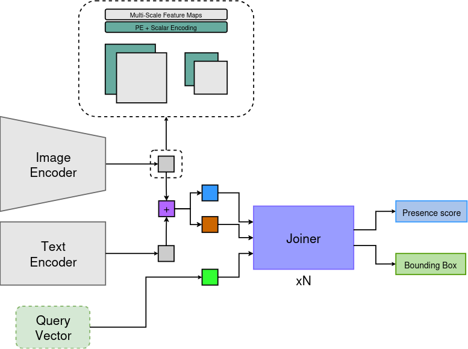
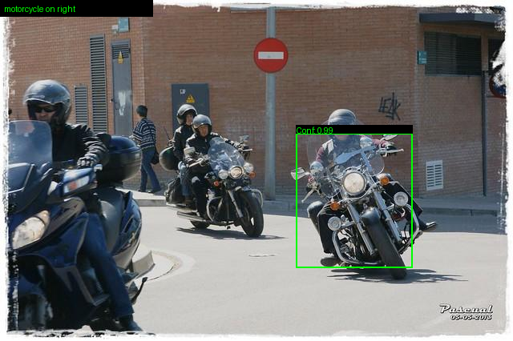
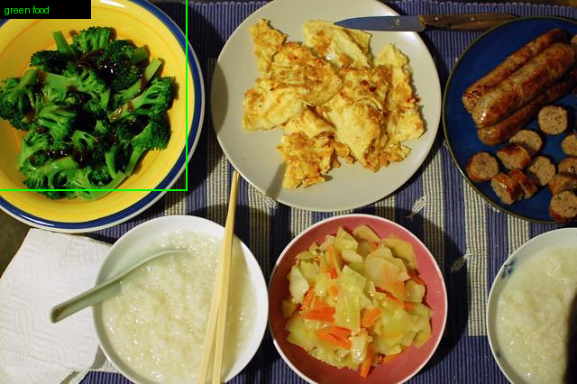
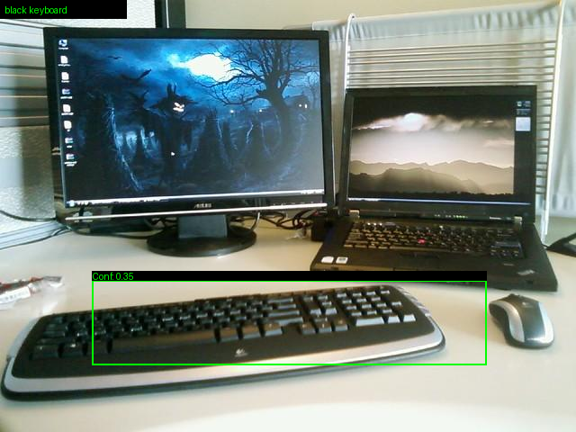
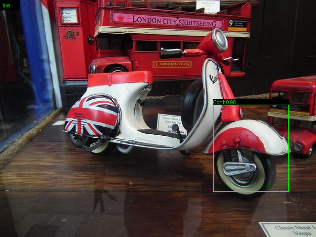
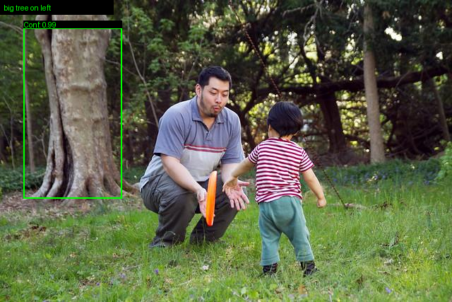

A light weight deep learning model capable to localize multiple objects from an input prompt.

    

Overall performance of valid sets of PhraseCutDataset and RefCOCO.
||Conf@0.2|Conf@0.3|Conf@0.4|Conf@0.5|Conf@0.6|
|-|-|-|-|-|-|
|**GIoU@0.30**|29.05%|28.73%|28.16%|27.32%|26.24%|
|**GIoU@0.50**|23.91%|23.76%|23.37%|22.74%|21.97%|
|**GIoU@0.75**|12.85%|12.96%|12.80%|12.47%|12.12%|

    
    
    
    
    

---